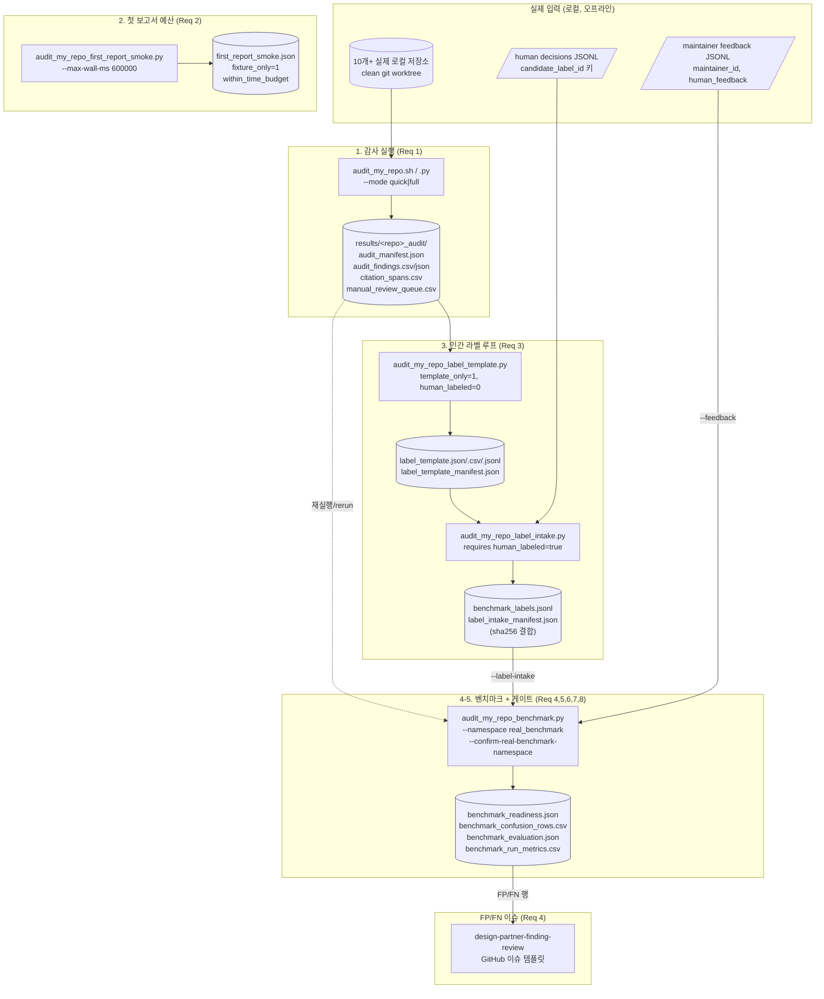

# Design Document

## Overview

본 설계는 기존 `audit-my-repo` 알파 도구를 **디자인 파트너 베타 후보(design-partner beta candidate)** 상태로 전환하기 위한 종단 간(end-to-end) 작업 흐름을 정의한다. 본 설계는 **새로운 도구·엔트리포인트·스키마·계약을 만들지 않는다** (Requirement 9). 오직 기존 스크립트(`scripts/audit_my_repo*.py`), 기존 스키마(`schemas/local_repo_audit_*.schema.json`), 기존 GitHub 이슈 템플릿(`design-partner-finding-review`)을 정해진 순서로 조합하여 `design_partner_beta_candidate_ready` 게이트를 막고 있는 하위 조건들을 **실제 인간 라벨 증거로** 닫는 것이 목표다.

핵심 설계 원칙:

1. **게이트는 계산값이지 입력값이 아니다.** `design_partner_beta_candidate_ready`는 `scripts/audit_my_repo_benchmark.py`가 하위 메트릭으로부터 파생하는 0/1 정수이며, 어떤 사람이 직접 1로 쓸 수 있는 필드가 아니다. 모든 readiness 산출물은 `--verify-existing` 경로에서 입력으로부터 재계산되며, 수동 편집은 드리프트(drift)로 거부된다 (Requirement 8).
2. **증거 경계는 단방향이다.** 합성/픽스처(synthetic/fixture) 출처 행은 `real_benchmark` 네임스페이스로 승격될 수 없고, 제품 readiness 계산에서 제외된다. `release_ready`/`public_comparison_claim_ready`/`real_model_execution_ready`는 항상 정수 0으로 고정된다 (Requirement 6, 범위 밖).
3. **유일한 상승 경로는 인간 라벨 루프다.** 템플릿 생성(`template_only=1`) → 인간 결정 인테이크(`human_labeled=true`) → `real_benchmark` 벤치마크 실행만이 게이트를 올릴 수 있다 (Requirement 3, 8.1).

본 설계는 코드를 변경하지 않는 **운영(operational) 설계**다. 산출물은 코드가 아니라 `results/` 하위의 증거 번들과, 그 증거를 만드는 정확한 명령 시퀀스, 그리고 각 요구사항이 어떤 기존 코드 경로로 충족되는지에 대한 매핑이다.

### 연구 조사 요약 (Research Findings)

기존 코드 동작을 직접 읽어 확인한 핵심 사실(설계의 근거):

- **게이트 계산 위치:** `audit_my_repo_benchmark.py`의 `main()` 내부에서 `real_human_label_basis`(= `product_readiness_calculated_from_real_labels`)와 14개 하위 `*_requirement_met` 비트를 계산하고, 그 논리곱으로 `design_partner_beta_candidate_ready`를 만든다 (벤치마크 스크립트 라인 ~2421–2483).
- **real_benchmark 확인 게이트:** `--namespace real_benchmark`는 `--confirm-real-benchmark-namespace` 없이는 사용 오류 코드 2로 종료한다 (라인 ~2274–2276). 확인되지 않으면 산출물을 쓰지 않는다.
- **합성 차단:** `real_human_label_basis`는 `namespace == "real_benchmark" and confirm and all(case.human_labeled and not case.synthetic)`일 때만 1이다 (라인 ~2421–2425). 즉 케이스가 하나라도 synthetic이면 모든 하위 게이트가 0으로 강제된다.
- **재계산 검증:** `--verify-existing`은 `benchmark_readiness.json`을 스키마 검증하고, `readiness_gate_rows(summary)`로 행을 재계산하여 저장된 행과 비교하며, 베타-ready인데 차단 게이트가 있으면 거부한다 (라인 ~2205–2229).
- **첫 보고서 600초 예산:** `audit_my_repo_first_report_smoke.py`가 `--max-wall-ms` 기본값 600,000을 사용하고 `within_time_budget = total_wall_ms <= max_wall_ms`로 게이트한다. `--verify-existing`은 이 불변식을 재계산하고 드리프트를 거부한다.
- **readiness 스키마 고정값:** `local_repo_audit_benchmark_readiness.schema.json`은 `release_ready`/`public_comparison_claim_ready`/`real_model_execution_ready`를 `const: 0`으로, `claim_boundary`를 `const: "alpha-local-code-doc-audit-only"`로 고정한다. 이 세 플래그가 0이 아닌 산출물은 스키마 검증 단계에서 거부된다.

## Architecture

### 컴포넌트 다이어그램



### 데이터 플로우 (단계별)

1. **감사 (Req 1):** 검증 담당자가 10개 이상의 실제 로컬 저장소 각각에 대해 `audit_my_repo.sh <repo> --mode quick|full --namespace real_benchmark --confirm-real-benchmark-namespace --out results/<repo>_audit`를 실행한다. 각 실행은 소스 바운드 발견과 `audit_manifest.json`을 쓰고 종료 코드 0으로 끝난다.
2. **첫 보고서 예산 (Req 2):** `audit_my_repo_first_report_smoke.py --out results/audit_first_report_smoke`로 설치→실행→보고서→검증 경로가 600초 이내임을 픽스처에서 1회 측정한다. 이는 픽스처 전용 영수증이며 베타/릴리스 readiness를 올리지 않는다.
3. **템플릿 (Req 3.1–3.2):** 각 검증된 감사 번들에 대해 `audit_my_repo_label_template.py --audit-output results/<repo>_audit --out results/<repo>_label_template --case-id <repo>`로 `template_only=1` 후보 행을 만든다. 각 행은 소스 발견·주 인용 스팬·수동 검토 큐 id를 결합한다.
4. **인테이크 (Req 3.3–3.4):** 디자인 파트너가 `candidate_label_id`로 키된 결정 행(`human_labeled:true`, `expected`, `priority`, `reviewer_id`)을 작성하고, `audit_my_repo_label_intake.py --template ... --decisions decisions.jsonl --out results/<repo>_label_intake`로 `benchmark_labels.jsonl`을 컴파일한다. 결정 입력 sha256과 템플릿 매니페스트 sha256이 결합된다.
5. **벤치마크 (Req 3.5–3.11, 4, 5):** `audit_my_repo_benchmark.py --label-intake results/<repo>_label_intake --feedback feedback.jsonl --namespace real_benchmark --confirm-real-benchmark-namespace --mode full --out results/audit_benchmark`로 평가한다. 인테이크가 재검증되고, 케이스별 TP/FP/FN/TN과 정밀도/인용 유효성이 계산되며, `benchmark_readiness.json` 체크리스트와 게이트가 산출된다.
6. **FP/FN 이슈 (Req 4):** `benchmark_confusion_rows.csv`의 FP/FN 행만을 근거로 `design-partner-finding-review` 이슈 템플릿에 케이스 id·발견 id·인용 스팬(파일/라인/sha256)을 채워 이슈 목록을 만든다.

## Components and Interfaces

각 컴포넌트는 **기존 스크립트**이며 인터페이스(CLI 계약)는 변경되지 않는다. 아래는 본 베타 경로에서 사용하는 표면만 기술한다.

### C1. Audit_Tool — `scripts/audit_my_repo.py` (+ `audit_my_repo.sh`)
- **역할:** 단일 로컬 저장소 감사. 소스 바운드 발견, 인용 스팬, 수동 검토 큐, 표준 JSON/SARIF, `audit_manifest.json`, `audit_semantic_summary.json` 생성.
- **본 경로의 입력 표면:** `<repo>`, `--mode quick|full`, `--namespace real_benchmark`, `--confirm-real-benchmark-namespace`, `--out results/...`.
- **불변식:** 동일 입력·동일 mode 재실행 시 동일 `cache_key`·동일 의미 결과 sha (Req 1.3). 출력이 대상 저장소 내부거나 손상/충돌 시 코드 2 (Req 1.4). 경로 부재 또는 잘못된 mode 시 0 아닌 코드 (Req 1.5).

### C2. First_Report_Smoke — `scripts/audit_my_repo_first_report_smoke.py`
- **역할:** 픽스처 git 저장소를 만들어 설치→quick 감사→검증을 수행하고 총 벽시계 시간을 측정.
- **핵심 필드:** `total_wall_ms`, `max_wall_ms`(기본 600000), `within_time_budget = int(total_wall_ms <= max_wall_ms)`, `first_report_success`, `fixture_only=1`, `design_partner_beta_candidate_ready=0`.
- **실패 정리:** 검증 실패 또는 예산 초과 시 사용자 지정 `--out`의 관리 대상 산출물(`fixture_repo`, `audit_out`, `first_report_smoke.json`)을 제거 (Req 2.2).
- **`--verify-existing`:** 영수증을 스키마 검증하고 `within_time_budget` 등 불변식을 재계산하며 감사 출력을 재검증.

### C3. Label_Template_Tool — `scripts/audit_my_repo_label_template.py`
- **역할:** 검증된 감사 번들 → `template_only=1`, `human_labeled=0` 후보 라벨 행.
- **결합:** 각 행에 `source_finding_id`, 주 인용 스팬(`file_path`/`expected_line_start`/`expected_line_end`/`expected_span_sha256`/`citation_id`), `source_review_queue_id` 결합 (Req 3.2).
- **synthetic 표식:** 입력 감사가 확인된 `real_benchmark`(`namespace==real_benchmark and real_benchmark_namespace_confirmed==1`)일 때만 `synthetic=0`, 그 외엔 `synthetic=1` (`build_template_rows`).
- **가드:** 입력 감사 검증 실패 시 행 생성 중단·코드 2·기존 출력 불변 (Req 3.9). 모든 readiness 필드 0 유지.

### C4. Label_Intake_Tool — `scripts/audit_my_repo_label_intake.py`
- **역할:** `candidate_label_id`로 키된 인간 결정 → `benchmark_labels.jsonl`.
- **강제:** 각 결정 행에 `human_labeled=true` 필수(`human_reviewed` 별칭 허용), 없으면 거부 (Req 3.4, 4단계의 `normalize_decisions`). `template_only` 표식 결정은 거부.
- **결합:** `decisions_input_sha256`, `template_manifest_sha256`, `template_sha256sums_sha256`를 인테이크 매니페스트에 결합 (Req 3.3).
- **증거 경계:** 후보의 `synthetic` 표식을 라벨로 보존(`"synthetic": truthy(candidate.synthetic)`); 합성 출처는 비합성으로 재분류되지 않음 (Req 6.2, 6.3). `present` 결정은 소스 바운드 인용 스팬 필수.
- **가드:** 템플릿 검증 실패 시 생성 중단·부분 출력 없음 (Req 3.10). 매니페스트 readiness 플래그 0 유지 (Req 6.5).

### C5. Benchmark_Harness — `scripts/audit_my_repo_benchmark.py`
- **역할:** 라벨/피드백 평가, 혼동 행·정밀도·인용 유효성·재실행 검사 산출, `benchmark_readiness.json` 게이트 계산.
- **입력 표면:** `--label-intake <dir>` (또는 `--labels`), `--feedback`, `--namespace real_benchmark`, `--confirm-real-benchmark-namespace`, `--mode full`, `--out results/...`, 기본 활성 `--rerun-check`(off: `--no-rerun-check`).
- **네임스페이스 게이트:** `real_benchmark` + 확인 플래그 부재 시 코드 2, 산출물 미기록 (Req 7).
- **인테이크 재검증:** `--label-intake` 전달 시 인테이크 번들을 재검증하고 그 매니페스트/sha를 벤치마크 매니페스트에 결합 (Req 3.5, 3.11).
- **게이트 계산:** 아래 "design_partner_beta_candidate_ready 계산" 절 참조.
- **`--verify-existing`:** 모든 벤치마크 JSON을 스키마 검증, 결합 값 재계산, 인테이크 번들·케이스별 감사 출력 재검증 (Req 8.3, 8.4).

### C6. Review_Converter — `scripts/audit_review_to_jsonl.py`
- **역할:** GitHub `design-partner-finding-review` 이슈 기반 인간 검토 라벨을 JSONL 결정 행으로 정규화하여 C4의 `--decisions` 입력으로 공급(보조 경로). 본 스펙은 이 기존 엔트리포인트만 사용하며 신규 계약을 만들지 않는다 (Req 9.1).

### C7. Verifier — `tools/verify_local_audit.py` + 각 도구 `--verify-existing`
- **역할:** 산출물 무결성·readiness 경계 검증. 게이트 무결성의 집행자 (Req 8).

### 요구사항 → 컴포넌트/플로우 매핑

| Requirement | 충족 컴포넌트 / 코드 경로 |
|---|---|
| **1. 실제 저장소 감사** | C1 `audit_my_repo.py`. 1.2 `audit_manifest.json` 입력경로/sha/`source_scope`; 1.3 cache_key·semantic sha 결정성; 1.4/1.5 종료 코드 2; 1.6 오프라인; 1.7 `real_repo_count >= 10` 게이트(C5) |
| **2. 첫 보고서 시간** | C2 `first_report_smoke.py` (`within_time_budget`, 600000ms). 2.3 C5 `benchmark_run_metrics.csv`의 `first_report_wall_ms`; 2.5/2.6 C5 `first_report_requirement_met` |
| **3. 인간 라벨 루프** | C3→C4→C5. 3.1/3.2 템플릿; 3.3/3.4 인테이크; 3.5/3.11 벤치마크 재검증; 3.6/3.7 repo snapshot 잠금; 3.8 `>=300` 라벨; 3.9/3.10 검증 실패 가드 |
| **4. FP/FN 이슈** | C5 `benchmark_confusion_rows.csv`(row_type/tp/fp/fn/tn) + `benchmark_evaluation.json`. 4.5 합성 미승격(`real_human_label_basis`) → C6 이슈 템플릿 |
| **5. readiness 체크리스트** | C5 `write_benchmark_readiness_json` + `READINESS_GATES` + readiness 스키마 |
| **6. 증거 경계** | C4 synthetic 보존 + C5 `real_human_label_basis`; readiness 스키마의 `const:0` 플래그 |
| **7. 네임스페이스 확인** | C5 argparse 가드 (라인 ~2274–2280) |
| **8. 게이트 무결성** | C5/C7 `--verify-existing` 재계산 + 드리프트 거부; 인간 라벨이 유일 경로 |
| **9. 기존 엔트리포인트 재사용** | 8개 스크립트 + 기존 스키마 + 기존 이슈 템플릿만 사용; `results/` 출력 경계 |

## Data Models

본 스펙은 데이터 모델을 **재정의하지 않는다**. 아래는 기존 산출물 형태에 대한 참조이며, 권위 있는 정의는 각 스키마/스크립트에 있다.

### 기존 스키마 (권위 출처)
- `schemas/local_repo_audit_benchmark_readiness.schema.json` — 베타 readiness 체크리스트. 필수 키: `schema_version`("local_repo_audit_benchmark_readiness.v1"), `tool_version`, `claim_boundary`, `product_readiness_calculated_from_real_labels`(0/1), `design_partner_beta_candidate_ready`(0/1), `release_ready`/`public_comparison_claim_ready`/`real_model_execution_ready`(**const 0**), `gate_rows`/`passed_gate_rows`/`blocked_gate_rows`(정수), `rows`. 각 `rows` 항목: `gate_id`, `passed`(0/1), `observed`(string), `required`(string), `blocked_reason`(string). `additionalProperties:false`.
- `schemas/local_repo_audit_benchmark_manifest|summary|evaluation|labels|...schema.json` — C5가 `BENCHMARK_SCHEMA_INSTANCE_PAIRS`로 검증.
- `schemas/local_repo_audit_label_template[_manifest].schema.json`, `..._label_intake_manifest.schema.json`, `..._first_report_smoke.schema.json` — C2/C3/C4 매니페스트.

### 주요 산출물 형태 (기존, 참조용)

`benchmark_readiness.json` (C5 `write_benchmark_readiness_json` 생성):
```jsonc
{
  "schema_version": "local_repo_audit_benchmark_readiness.v1",
  "tool_version": "audit_my_repo_alpha.v1",
  "claim_boundary": "alpha-local-code-doc-audit-only",
  "product_readiness_calculated_from_real_labels": 0,
  "design_partner_beta_candidate_ready": 0,
  "release_ready": 0,
  "public_comparison_claim_ready": 0,
  "real_model_execution_ready": 0,
  "gate_rows": 14,
  "passed_gate_rows": 0,
  "blocked_gate_rows": 14,
  "rows": [
    {"gate_id": "real_repo_requirement_met", "passed": 0,
     "observed": "0", "required": "10",
     "blocked_reason": "At least 10 real local repositories"}
    // ... 14개 게이트
  ]
}
```

`benchmark_confusion_rows.csv` (FP/FN 이슈 도출 원천, `CONFUSION_FIELDS`):
`case_id, row_type, label_id, plugin_id, rule_id, file_path, expected_line_start, expected_line_end, expected_span_sha256, expected, priority, matched_finding_id, citation_expectation_supplied, matched_citation_id, citation_expectation_met, outcome, tp, fp, fn, tn`.

`benchmark_run_metrics.csv` (`RUN_METRIC_FIELDS`): `first_report_success`, `first_report_wall_ms`, `cache_key`, `semantic_result_sha256`, `rerun_*` 등.

`first_report_smoke.json` (C2): `total_wall_ms`, `max_wall_ms`, `within_time_budget`, `first_report_success`, `fixture_only=1`, `design_partner_beta_candidate_ready=0`.

`benchmark_labels.jsonl` (C4 행): `case_id, label_id, repo_path, expected_repo_git_head, human_labeled, synthetic, priority, maintainer_id, maintainer_feedback, plugin_id, rule_id, file_path, expected_line_start/end, expected_span_sha256, expected, expected_abstain, source_candidate_label_id, source_finding_id, source_review_queue_id`.

### `design_partner_beta_candidate_ready` 계산 (정확한 하위 게이트 집합)

C5는 먼저 **증거 기반 비트**를 계산한다:

```
real_human_label_basis (= product_readiness_calculated_from_real_labels) =
    namespace == "real_benchmark"
    AND confirm_real_benchmark_namespace
    AND len(cases) > 0
    AND 모든 case에 대해 (case.human_labeled AND NOT case.synthetic)
```

이 비트가 0이면 **아래 모든 하위 게이트가 0으로 강제**된다 (각 게이트 식이 `real_human_label_basis == 1`을 전제로 함). 14개 하위 게이트(`READINESS_GATES`, observed/required 키 포함):

| gate_id | observed | required | 통과 조건 (요약) |
|---|---|---|---|
| `real_repo_requirement_met` | `real_repo_count` | `min_real_repos_required`(10) | 고유 repo_path ≥ 10 |
| `human_label_requirement_met` | `human_label_rows` | `min_human_label_rows_required`(300) | 라벨 행 ≥ 300 |
| `label_source_trace_requirement_met` | `label_source_trace_rows` | `human_label_rows` | 모든 라벨이 candidate+review-queue trace 보존 |
| `repo_snapshot_requirement_met` | `repo_snapshot_locked_rows` | `repo_snapshot_rows` | 모든 케이스 clean HEAD 잠금 |
| `maintainer_feedback_requirement_met` | `maintainer_feedback_count` | `min_maintainer_feedback_required`(3) | 고유 유지보수자 피드백 ≥ 3 |
| `overall_precision_requirement_met` | `precision` | `overall_precision_threshold`(0.80) | precision ≥ 0.80 且 TP+FP>0 |
| `p0_p1_precision_requirement_met` | `p0_p1_precision` | `p0_p1_precision_threshold`(0.90) | P0/P1 precision ≥ 0.90 且 행>0 |
| `citation_validity_requirement_met` | `citation_validity_pass_rows` | `citation_validity_rows` | 인용 유효성 100% 且 행>0 |
| `label_citation_expectation_requirement_met` | `label_citation_expectation_met_rows` | `label_citation_expectation_rows` | 모든 인용 기대 매칭 且 citation-unbound 0 |
| `standard_json_findings_requirement_met` | `standard_json_findings_valid_rows` | `standard_json_findings_checked_rows` | 모든 표준 JSON 발견 검증 통과 |
| `install_success_requirement_met` | `install_success_rows` | `install_check_rows` | 설치/preflight 성공 |
| `first_report_requirement_met` | `first_report_success_rows` | `case_rows` | 모든 케이스 첫 검증 보고서 성공 |
| `rerun_requirement_met` | `rerun_success_rows` | `rerun_checked_rows` | 재실행/캐시/의미 반복성 성공 且 검사>0 |
| `label_quality_requirement_met` | `label_quality_specific_rows` | `label_quality_total_rows` | broad/citation-unbound/duplicate/contradictory 부재 |

최종:
```
design_partner_beta_candidate_ready = AND(위 14개 게이트 전부) AND label_quality_requirement_met==1
```

`write_benchmark_readiness_json`은 `passed`/`observed`/`required`/`blocked_reason` 행을 만들고 `gate_rows`/`passed_gate_rows`/`blocked_gate_rows`를 집계한다 (`blocked_reason`은 통과 시 빈 문자열, 실패 시 게이트 설명).

> **첫 보고서 600초 경계의 정확한 위치 (Req 2.5/2.6 정합):** 600,000ms 임계 자체는 **C2 First_Report_Smoke**의 `within_time_budget = total_wall_ms <= max_wall_ms`(기본 600000)에서 집행되며, 예산 초과 시 영수증이 실패로 표시되고 산출물이 정리된다. C5 벤치마크의 `first_report_requirement_met`는 케이스별 `first_report_success`(보고서 존재 + 검증 통과)에 기반하고, 케이스별 `first_report_wall_ms`를 `benchmark_run_metrics.csv`에 기록한다. 따라서 "첫 보고서 시간 > 600000ms ⇒ 요구사항 미충족"의 권위 있는 집행 지점은 C2이며, C5는 성공 여부와 측정 시간을 증거로 기록한다. 본 설계의 운영 절차는 두 경로를 함께 사용해 Req 2 전체를 닫는다.


## Correctness Properties

*속성(property)은 시스템의 모든 유효한 실행에서 참이어야 하는 특성 또는 동작이다 — 본질적으로 시스템이 무엇을 해야 하는지에 대한 형식적 진술이다. 속성은 사람이 읽는 명세와 기계로 검증 가능한 정확성 보증 사이의 다리 역할을 한다.*

아래 속성들은 본 스펙이 **새 코드를 만들지 않으므로** 기존 코드의 판정 함수(게이트 계산, `verify_*` 재계산, `within_time_budget`, `case_repo_snapshot`, 증거 경계)를 대상으로 한다. 각 속성은 합성 입력 생성기로 100회 이상 반복 검증 가능한 형태로 표현한다. 모든 속성은 기존 동작을 재기술할 뿐 새로운 계약을 도입하지 않는다 (Requirement 9).

### Property 1: 감사 결정성 (재실행 멱등)
*임의의* 로컬 저장소 fixture(랜덤 파일 내용 포함)에 대해, 동일 경로와 동일 `--mode`로 감사를 두 번 실행하면 두 실행의 `cache_key`와 `semantic_result_sha256`가 동일하다.
**Validates: Requirements 1.3**

### Property 2: 실제 저장소 수 임계 게이트 단조성
*임의의* `real_human_label_basis` 비트와 고유 `repo_path` 개수 n에 대해, `real_repo_requirement_met == (basis==1 AND n >= 10)`이 성립한다. (동일 형태가 `human_label_requirement_met`의 300 임계, `maintainer_feedback_requirement_met`의 3 임계에도 성립한다.)
**Validates: Requirements 1.7, 3.8**

### Property 3: 첫 보고서 시간 예산 경계
*임의의* 음이 아닌 정수 `total_wall_ms`와 양의 정수 `max_wall_ms`에 대해, `within_time_budget == int(total_wall_ms <= max_wall_ms)`이며, `max_wall_ms == 600000`일 때 `total_wall_ms > 600000`이면 `within_time_budget == 0`이다. (이 값이 0이면 스모크는 실패로 표시되고 증거 기반이 성립하지 않아 `first_report_requirement_met`는 0으로 유지된다.)
**Validates: Requirements 2.2, 2.5, 2.6**

### Property 4: 템플릿 행 불변식
*임의의* 검증된 감사 번들(임의 개수의 비억제 발견 포함)에서 생성한 모든 라벨 템플릿 행은 `template_only == 1`, `human_labeled == 0`이며, `case_id`·`candidate_label_id`·`source_finding_id`·`source_review_queue_id`·주 인용 스팬을 비어 있지 않게 결합하고, 4개 readiness 필드를 모두 0으로 유지한다.
**Validates: Requirements 3.1, 3.2**

### Property 5: human_labeled 결정만 수용
*임의의* 결정 행 집합에 대해, `human_labeled`(또는 별칭 `human_reviewed`)가 참이 아닌 행이 하나라도 있으면 인테이크 컴파일은 거부(오류)되며 그 행은 `benchmark_labels.jsonl`에 포함되지 않는다.
**Validates: Requirements 3.4**

### Property 6: 저장소 스냅샷 잠금 판정 및 집계
*임의의* 케이스 저장소 상태(git 가용/dirty/기대 HEAD 유무/HEAD 일치 여부)에 대해, `repo_snapshot_locked == int(git_available AND NOT dirty AND NOT missing_expectation AND NOT mismatch)`이다. 그리고 *임의의* 케이스 집합에 대해, 잠기지 않은 케이스가 하나라도 있으면 `repo_snapshot_requirement_met == 0`이다.
**Validates: Requirements 3.6, 3.7**

### Property 7: 혼동 행 분류 일관성과 정밀도 정합
*임의의* 라벨/발견 쌍 집합에 대해, 각 혼동 행의 `tp`,`fp`,`fn`,`tn`은 상호 배타적(합이 1인 단일 분류)이고, 집계된 `precision`은 `tp/(tp+fp)`(분모>0일 때)와 일치하며, P0/P1 부분집합 정밀도도 동일 관계를 만족한다.
**Validates: Requirements 4.1**

### Property 8: 증거 기반(real_human_label_basis) 정의
*임의의* (namespace, confirm, cases, 각 케이스의 human_labeled/synthetic) 조합에 대해,
`product_readiness_calculated_from_real_labels == int(namespace=="real_benchmark" AND confirm AND len(cases)>0 AND 모든 케이스(human_labeled AND NOT synthetic))`
이다. 따라서 합성 케이스가 하나라도 있거나, 비-real_benchmark 네임스페이스이거나, 확인 플래그가 없으면 이 값은 0이다.
**Validates: Requirements 4.5, 6.1, 8.1**

### Property 9: basis=0이면 모든 하위 게이트와 베타 게이트가 0
*임의의* 메트릭 값 집합에 대해, `product_readiness_calculated_from_real_labels == 0`이면 14개 `*_requirement_met` 비트가 모두 0이고 `design_partner_beta_candidate_ready == 0`이다.
**Validates: Requirements 4.5, 6.1**

### Property 10: 베타 게이트는 하위 게이트의 논리곱
*임의의* 14개 하위 게이트 비트 조합에 대해, `design_partner_beta_candidate_ready == AND(모든 하위 게이트)`이며, `design_partner_beta_candidate_ready == 1`이면 `blocked_gate_rows == 0`이고, `== 0`이면 (게이트 행이 존재할 때) `blocked_gate_rows > 0`이다.
**Validates: Requirements 5.3, 5.4**

### Property 11: 체크리스트 집계 보존
*임의의* readiness 요약에 대해, `passed_gate_rows + blocked_gate_rows == gate_rows == len(rows)`이며, 각 행의 `blocked_reason`은 `passed==1`일 때 빈 문자열, `passed==0`일 때 비어 있지 않다.
**Validates: Requirements 5.5, 5.1**

### Property 12: 합성/픽스처 출처 보존 (재분류 불가)
*임의의* 템플릿 후보 행에 대해, 인테이크가 컴파일한 라벨의 `synthetic` 표식은 후보의 `synthetic`과 동일하다. 또한 입력 감사가 확인된 `real_benchmark`가 아니면(`namespace=="real_benchmark" AND real_benchmark_namespace_confirmed==1`이 거짓) 템플릿 행의 `synthetic`은 항상 1이다.
**Validates: Requirements 6.2, 6.3, 6.6**

### Property 13: 차단 readiness 플래그 0 불변식
*임의의* 산출물(`benchmark_readiness.json`, 벤치마크/인테이크/템플릿 매니페스트, 요약)에 대해, `release_ready == 0`, `public_comparison_claim_ready == 0`, `real_model_execution_ready == 0`이다. (readiness 스키마가 이 세 값을 `const 0`으로 고정하므로 위반 산출물은 스키마 검증에서 거부된다.)
**Validates: Requirements 6.4, 6.5**

### Property 14: 검증 재계산이 수동 편집을 거부
*임의의* 검증을 통과하는 `benchmark_readiness.json`(또는 결합된 매니페스트/요약)에서 readiness/게이트 관련 필드를 임의로 변조하면, `--verify-existing` 재계산 경로는 항상 드리프트로 그 변조를 거부한다(검증 오류, 종료 코드 1).
**Validates: Requirements 8.2, 8.4**

## Error Handling

본 스펙은 기존 도구의 에러 계약을 **그대로 사용**한다. 운영 절차는 아래 코드/사유를 기대값으로 삼는다.

| 상황 | 책임 컴포넌트 | 동작 | 종료 코드 |
|---|---|---|---|
| 저장소 경로 부재 / 잘못된 `--mode` | C1 | 감사 미시작, 입력 오류 메시지 | 0 아님 (Req 1.5) |
| 출력이 대상 repo 내부 / 손상 출력 / `latest` 충돌 | C1 | 산출물 미생성 | 2 (Req 1.4) |
| 첫 보고서 예산 초과 / 자기검증 실패 | C2 | 영수증 실패 표시, `--out` 관리 산출물 제거 | 1 (Req 2.2) |
| 입력 감사 검증 실패 | C3 | 행 생성 중단, 기존 출력 불변 | 2 (입력 오류) (Req 3.9) |
| 결정 행에 `human_labeled=true` 없음 | C4 | 행 거부, 부분 출력 없음 | 2 (입력) / 1 (검증) (Req 3.4, 3.10) |
| 템플릿 번들 검증 실패 | C4 | 인테이크 중단, 부분 산출물 없음 | 1/2 (Req 3.10) |
| `real_benchmark` + 확인 플래그 부재 | C5 | 실행 미시작, 산출물 미기록 | 2 (Req 7.2, 7.3) |
| `--confirm-real-benchmark-namespace`를 비-real_benchmark에 사용 | C5 | 사용 오류 | 2 |
| 인테이크 재검증 실패 | C5 | 벤치마크 중단, 매니페스트 미결합 | 1 (Req 3.11) |
| `--verify-existing` 드리프트/스키마 실패/가드 실패 | C5/C7 | 검증 실패, 사유를 stderr로 | 1 (Req 8.4) |
| `results/` 외부 출력 시도 | C1/C5 | 산출물 미기록, 경로 위반 오류 | 2 (Req 9.5) |

원자성: C2/C3/C4/C5는 staging→self-verify→publish 패턴과 실패 시 롤백/백업 복원을 사용한다. 실패 경로는 부분 산출물을 남기지 않으며, 사용자 지정 `--out`의 비관리 파일은 삭제하지 않는다.

증거 경계 에러 처리: 합성/픽스처 출처를 실제 증거로 승격하려는 시도는 거부되거나(인테이크), 게이트 계산에서 `real_human_label_basis=0`으로 무력화된다. `tamper` 환경변수 훅(예: `AUDIT_MY_REPO_*_TAMPER_BEFORE_VERIFY`)은 자기검증이 변조를 잡아내는지 확인하는 기존 음성 통제 수단이다.

## Testing Strategy

본 스펙은 코드를 추가하지 않으므로 테스트 전략은 **기존 테스트 자산 + 속성 기반 검증으로 게이트 로직을 고정**하는 데 집중한다.

### 기존 테스트/검증 자산 (재사용)
- `experiments/test_audit_my_repo_product_entrypoint.sh` — 제품 엔트리포인트 정상 경로 스모크.
- `experiments/test_audit_my_repo_negative_controls.sh` — 음성 통제(잘못된 경로/네임스페이스/변조 거부).
- 각 도구의 `--verify-existing` — 스키마 검증 + 결합 값 재계산 + 케이스/인테이크 재검증 (Req 8.3).
- `tools/validate_json_schemas.py --schema-instance` — readiness 등 산출물의 스키마 검증 (Req 5.2).
- `./scripts/ai-verify.sh` — 저장소 전체 검증(작업 완료 표시 전 필수, AGENTS.md).

### 단위/예시 테스트 (구체 동작·에지)
- `audit_manifest.json` 키 형태 (1.2), `first_report_smoke.json` 측정 형태 (2.1, 2.4), `benchmark_run_metrics.csv` 케이스 행 (2.3), `benchmark_evaluation.json` 키 (4.4), readiness 행 4필드 (5.1).
- 에지/에러: 1.4, 1.5, 3.9, 3.10, 3.11, 7.2, 7.3, 8.4, 9.5 — 종료 코드와 산출물 부재/불변 확인.
- 스모크/거버넌스: 1.6(`external_network_used==0`), 9.1/9.2/9.3/9.4/9.6 — `audit_my_repo_package.py --verify-existing`의 `REQUIRED_PRODUCT_FILES`/스키마 sha 목록과 `.gitignore`로 확인.

### 속성 기반 테스트 (PBT) — Correctness Properties 14개
- **라이브러리:** Python `hypothesis` (기존 저장소가 Python 도구 체계이므로 동일 스택 사용; 처음부터 구현하지 않음).
- **반복:** 각 속성 테스트 최소 100회 (`@settings(max_examples=100)` 이상).
- **태그 형식(주석):** `# Feature: audit-my-repo-design-partner-beta, Property {n}: {property_text}`.
- **각 속성 = 단일 속성 테스트.** 대상은 순수 판정 함수와 재계산 경로:
  - Property 8/9/10/11 — 게이트 계산 로직(`real_human_label_basis` 정의, `READINESS_GATES` 논리곱, `readiness_gate_rows`/`write_benchmark_readiness_json` 집계). 입력은 합성 메트릭 딕셔너리.
  - Property 3 — `within_time_budget`/`verify_receipt` 시간 불변식. 입력은 랜덤 정수 쌍.
  - Property 6 — `case_repo_snapshot` 잠금 판정. 입력은 git 상태 조합(소형 git fixture 또는 상태 매개변수화).
  - Property 4/5/12 — 템플릿/인테이크 행 불변식과 합성 보존. 입력은 합성 발견/후보/결정 행.
  - Property 7 — 혼동 분류·정밀도 정합. 입력은 라벨/발견 쌍.
  - Property 1 — 감사 결정성. 비용을 고려해 소형 fixture 저장소를 생성하고 quick 모드로 제한.
  - Property 2 — 임계 게이트 단조성. 입력은 basis 비트와 카운트.
  - Property 13/14 — 차단 플래그 0 불변식과 변조 거부. 입력은 임의 필드 변조; `--verify-existing` 재계산이 거부함을 단언.
- **비용 통제:** 외부 프로세스/파일시스템이 필요한 속성(1, 6)은 소형 fixture와 quick 모드로 제한하고, 순수 판정 로직(2, 3, 7~14)은 함수 단위로 직접 호출해 100회 이상 저비용 반복한다.

### 검증 순서 (저비용 우선, AGENTS.md 정합)
1. `python3 -m py_compile`로 변경 없음/구문 확인 → 2. 스키마 검증 → 3. 속성 테스트(소형 fixture) → 4. `--verify-existing` 재검증 → 5. `./scripts/ai-verify.sh`.
실제 `real_benchmark` 전체 실행(10개 저장소·300+ 라벨)은 사용자 승인 후 수행하는 운영 단계이며, 본 설계의 자동 검증 범위 밖이다(긴 실행/증거 수집 절차).

## In-Scope / Out-of-Scope

**In-Scope (본 스펙):**
- 10개 이상 실제 로컬 저장소 감사 실행 절차 (Req 1).
- 첫 보고서 600초 예산 측정 (Req 2).
- 라벨 템플릿 → 인테이크 → `real_benchmark` 벤치마크 인간 라벨 루프 1회 완주 (Req 3, 7).
- `benchmark_confusion_rows.csv` 기반 FP/FN 이슈 목록 (Req 4).
- `benchmark_readiness.json` 베타 readiness 체크리스트와 `design_partner_beta_candidate_ready` 게이트 정의·계산 (Req 5).
- 증거 경계·게이트 무결성 강제의 명시 (Req 6, 8).
- 기존 8개 엔트리포인트·기존 스키마·기존 이슈 템플릿만 사용 (Req 9).

**Out-of-Scope (명시적 제외):**
- `release_ready`, `public_comparison_claim_ready`, `real_model_execution_ready` — 본 스펙에서 다루지 않으며 정수 0으로 고정 유지(스키마 `const 0`).
- 신규 도구/스크립트/엔트리포인트/계약/스키마/이슈 템플릿 생성 (Req 9가 금지).
- 네트워크 접근, GPU 사용, 외부 다운로드, 체크포인트 materialization, 패키지 업로드, 외부 트래커/레지스트리 쓰기 (AGENTS.md 승인 필요 항목).
- 실제 모델 실행이나 공개 비교 주장 산출.
